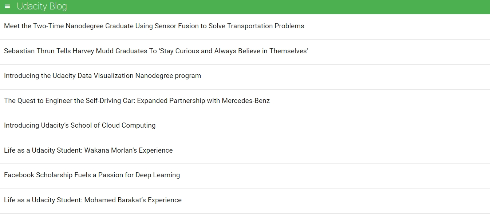
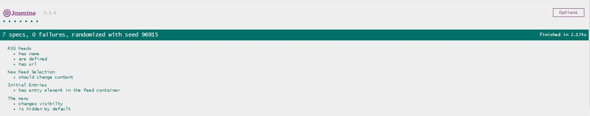

# Table Of Content

* Project Overview
* How to Run
* Used Libraries and Framework
* screenShots

# Project Overview

This project is a web-based application that reads RSS feeds.
Udacity providd the starter code for the application, I've edited it to add the necessary test suites for it to perform perfectly.
the testing is done using [Jasmine](http://jasmine.github.io/). 
	 [Udacity's starter code](https://github.com/udacity/frontend-nanodegree-feedreader).

# How To Run

* Clone or download this git repository to your computer.
* Open index.html file.
* scroll down to the bottom of the page, you will find the jasmine specs.

# Used Libraries and Framework

* JQuery
* [Jasmine](https://jasmine.github.io/) 

# Screenshots

